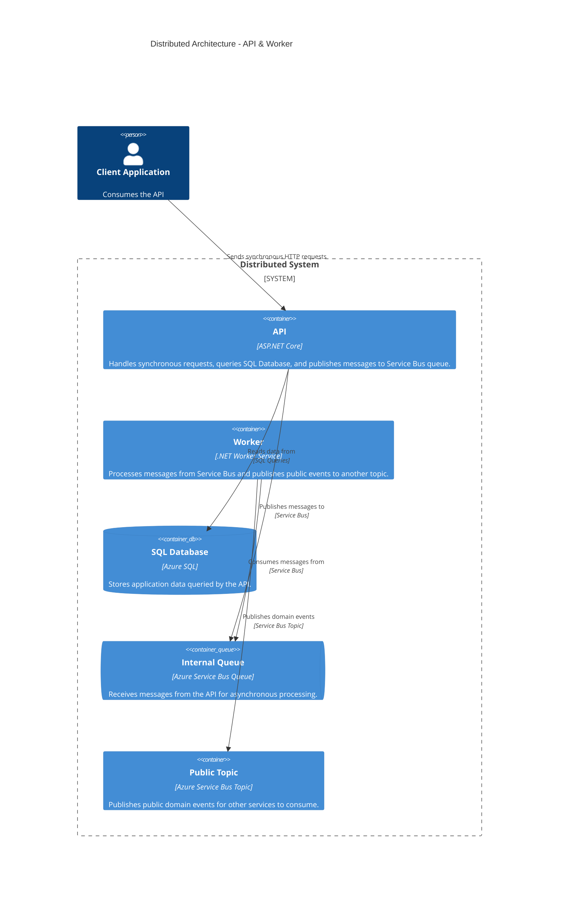

# Battleship Game Project

Battleship Game engine with Event Sourcing, CQRS and C#

## Dependencies

### Packages

- [StronglyTypedIds](https://github.com/andrewlock/StronglyTypedId) - The DDD-Style **strongly typed ids*** to avoid primitive obsession, [Andrew Lock](https://andrewlock.net/series/using-strongly-typed-entity-ids-to-avoid-primitive-obsession/);
- Sqids - Obfuscate Numbers;
- Mapperly - .NET source generator for generating object mappings;

## Architecture

### Patterns

- [CQRS pattern](https://learn.microsoft.com/en-us/azure/architecture/patterns/cqrs)
- Event Source
- Outbox Pattern
- [Transactional outbox] (https://microservices.io/patterns/data/transactional-outbox.html)
- Mediator (with MediatR)
  - Organize code around use cases with requests and handlers
  - Cross-cutting concerns with pipeline behaviors
  - Thin API endpoints (avoiding fat endpoints)
  - Design highly-testable handlers

### Most Common filters
Mechanism to intercept and modify the execution of a request pipeline;

- IAuthorizationFilter (Authorization - Run early to allow/deny access)
- IResourceFilter (Resource - Wrap around the entire request)
- IActionFilter (Action - Run before/after controller actions)
- IExceptionFilter (Exception - Handle exceptions globally)
- IResultFilter (Result - Before/after the result is executed)

Useful for concerns like:

- Logging
- Authorization
- Exception handling
- Validation
- Caching

## Message Brokers

### RabbitMQ (with plugins)

- For Scheduled Delivery. Needs Delayed Message Plugin
- Ordered Queues / Sessions. FIFO within queue; limited session-like behavior via x-group-id or custom logic
- Simulate RabbitMQ behavior with https://tryrabbitmq.com/

#### Start RabbitMQ Locally

#### Install RabbitMQ Client in .NET

### NATS

- Scheduled Delivery. Custom delay (not native) via stream retention + cron/consumer delay;
- Ordered Queues / Sessions. Ordered consumers, but not true sessions

#### Start NATS Locally

- Install NATS Server:
Download from NATS.io

- Or use Docker:
´´´
docker run -d --name nats-server -p 4222:4222 nats:latest
´´´

#### Install NATS Client in .NET

- Add the required package:
´´´
dotnet add package NATS.Client.Core

´´´

#### NATS.Client.Core features

- Async/Await Support -> Full support (async-first design);
- Performance -> Faster, more optimized;
- Dependency Overhead -> Lightweight;
- Ease of Use -> Async-first API;
- Streaming Support -> **JetStream** built-in;
- Active Development -> Actively improved;

### Best Practices for Reducing Message Size

- Minimize Payload – Only send essential fields (command and executeAt);
- Use Binary Format – Instead of JSON, use **ProtoBuf* for smaller payloads;
- Dedicated Subjects – Use subjects like scheduled.jobs.destroygame for specific tasks to reduce unnecessary processing;

#### How is Protobuf Better?

- Smaller Size - Protobuf messages are compact and efficient;
- Faster Serialization - Binary format is much faster than JSON;
- Cross-Language Support - Works with other languages easily;

### Future implementation to improve message handler

- Implement retries and failure handling;
- Add logging and monitoring;
- Use NATS JetStream if message persistence is needed;

## Structure

# battleship-game

